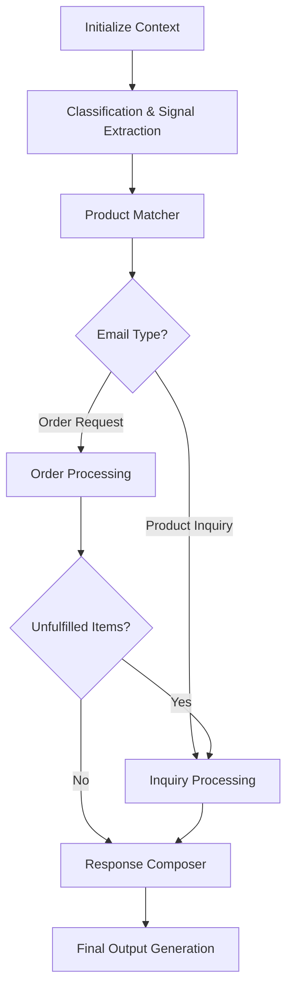

# Project Hermes: Email Processing Pipeline Documentation

## Overview

Project Hermes implements a sophisticated pipeline architecture to process customer emails for a fashion retail store. This document explains the design, data flow, and principles behind the system rather than focusing on specific implementation details.

The pipeline is based on the agent architecture defined in ITD-005-Agent-Architecture.md, using a series of specialized agents that progressively enrich a context object as emails flow through the system.

## Architecture Principles

1. **Sequential Processing with Context Enrichment**: Each agent adds to a growing context object that flows through the pipeline.
2. **Specialized Agents**: Each agent has a specific role with clear inputs and outputs.
3. **Conditional Pathways**: Different email types follow different paths through the pipeline.
4. **Stateful Processing**: The system maintains state (particularly inventory) across multiple email processing runs.

## Pipeline Flow

## Context Structure

The system maintains a rich context object that grows as the email passes through the pipeline. The key components include:

### Input Data
- **Email**: Contains email_id, subject, and message body
- **Product Catalog**: Complete product data including descriptions, prices, and categories
- **Inventory**: Current stock levels for all products

### Agent Outputs
- **Classification Results**: Email category and extracted signals
- **Product Matches**: Mapped products for both orders and inquiries
- **Order Processing Results**: Fulfilled/unfulfilled items and inventory updates
- **Inquiry Processing Results**: Answers to questions and product recommendations
- **Response Content**: Generated response ready for delivery to the customer

### Output Data
- Structured data ready for the four required output spreadsheets

## Agent Descriptions

### 1. Classification & Signal Extraction Agent

**Purpose**: Analyzes incoming emails to determine primary intent and extract customer signals.

**Process**:
- Reads the entire email to understand the overall context
- Classifies as "order request" or "product inquiry" (with order taking precedence in mixed emails)
- Extracts customer signals using the taxonomy from the Sales Email Intelligence Guide
- Maps each signal to specific phrases in the email

**Signals Taxonomy**:
- Product identification (product codes, names, vague references)
- Purchase intent (direct intent, browsing intent, price inquiry)
- Customer context (business use, gift purchase, seasonal need)
- Request specificity (detailed questions, general inquiries)
- Upsell opportunities (celebration mentions, collection building)
- Communication style (formal/casual, detailed/concise)
- Emotional tone (enthusiasm, uncertainty, frustration)
- And more from the Sales Email Intelligence Guide

**Key Decisions**:
- For mixed-intent emails, classifies as "order request" but preserves inquiry components
- Handles ambiguous intent with lower confidence scores
- Provides high recall of signals, even if some are low confidence

### 2. Product Matcher Agent

**Purpose**: Maps customer product references to specific items in the product catalog.

**Process**:
- Uses three matching strategies in priority order:
  1. Exact product code matching
  2. Fuzzy product name matching
  3. Vector similarity search for descriptive references
- Determines if each matched product is part of an order or inquiry
- Extracts quantity information for order items
- Identifies specific questions about inquiry items

**Key Technologies**:
- Fuzzy matching for handling misspellings and variations
- Vector embeddings for semantic matching of descriptive references
- Confidence scoring to communicate match quality

**Handling Edge Cases**:
- Ambiguous references that could match multiple products
- Category-only references (e.g., "a shirt", "some shoes")
- Complementary product references (products mentioned as pairs or sets)

### 3. Order Processing Agent

**Purpose**: Processes order requests by checking inventory and determining fulfillment status.

**Process**:
- Checks each order item against current inventory
- Assigns status: "created" for fulfilled items, "out_of_stock" for unavailable items
- Updates inventory for fulfilled items
- Identifies alternatives for out-of-stock items
- Flags unfulfilled items for further inquiry processing

**Inventory Management**:
- Maintains a running inventory count across multiple email processes
- Ensures inventory never goes below zero
- Records inventory updates for tracking

**Alternative Product Recommendations**:
- Suggests alternatives based on:
  - Same product category
  - Similar price range (±20%)
  - Similar style attributes
  - Current availability

### 4. Inquiry Processing Agent

**Purpose**: Answers customer questions and provides product recommendations.

**Process**:
- Retrieves relevant product information from the catalog
- Answers specific questions about products
- Evaluates alternatives for unfulfilled order items
- Identifies upsell/cross-sell opportunities based on customer signals

**Information Retrieval**:
- Uses RAG (Retrieval Augmented Generation) to ground responses in catalog data
- Focuses on aspects specifically mentioned in customer questions
- Avoids hallucinating features not present in the catalog

**Recommendation Generation**:
- Prioritizes alternatives that match customer context and needs
- Identifies upsell opportunities with different relevance levels:
  - High: Directly complementary products
  - Medium: Category-related or context-appropriate items
  - Low: Generally popular or promotional items

### 5. Response Composer Agent

**Purpose**: Generates cohesive, personalized email responses that address all customer needs.

**Process**:
- Determines appropriate structure based on email type
- Applies tone and style matching the customer's communication
- Crafts responses following Natural Communication Guidelines
- Integrates order confirmation and inquiry responses as needed
- Incorporates appropriate upsells/cross-sells

**Response Organization**:
- Prioritizes order confirmations before inquiry responses (unless inquiry affects order)
- Uses appropriate transition phrases between topics
- Ensures all questions and order elements are addressed

**Personalization Techniques**:
- Matches customer's level of formality
- Adapts to their communication style (detailed vs. concise)
- Acknowledges emotional signals appropriately
- Connects product features to expressed needs or concerns

## Special Processing Scenarios

### Mixed Intent Email Handling

When emails contain both order and inquiry elements:

1. **Classification**: Categorized as "order request" with inquiries noted
2. **Product Matching**: Products separated into order_items and inquiry_items arrays
3. **Order Processing**: Handles the order elements
4. **Conditional Path**: If there are unfulfilled items, they're passed to Inquiry Processing
5. **Inquiry Processing**: Processes both explicit inquiries and unfulfilled order alternatives
6. **Response Composition**: Integrates both order confirmation and inquiry responses

### Out-of-Stock Handling

When ordered items are unavailable:

1. **Order Processing**: Marks items as "out_of_stock"
2. **Alternative Identification**: Finds suitable alternatives with same category/style/price
3. **Inquiry Processing**: Evaluates alternatives based on customer signals
4. **Response Composition**: Explains out-of-stock situation empathetically and suggests alternatives

### Non-English Email Support

The system can handle non-English emails through:

1. **Language Detection**: Identifies the email language
2. **Signal Extraction**: Works across languages to identify key signals
3. **Product Matching**: Functions with non-English product references
4. **Response Generation**: Creates responses in the same language as the input

## Output Generation

The pipeline produces four output spreadsheets as required by the project:

1. **Email Classification Sheet**:
   - Columns: email ID, category
   - Lists the classification for each processed email

2. **Order Status Sheet**:
   - Columns: email ID, product ID, quantity, status
   - Contains entries for all order items with their fulfillment status

3. **Order Response Sheet**:
   - Columns: email ID, response
   - Contains responses for all emails classified as order requests

4. **Inquiry Response Sheet**:
   - Columns: email ID, response
   - Contains responses for all emails classified as product inquiries

## Extension Points

The pipeline architecture is designed for extensibility:

1. **Feedback Loop**: The system could track customer responses to improve over time
2. **A/B Testing**: Different response styles could be tested for effectiveness
3. **Multi-Language Support**: Enhanced language detection and translation
4. **Sentiment Analysis**: Deeper analysis of customer emotional state
5. **Customer History Integration**: Incorporating past purchase behavior

## Implementation Technologies

The primary technologies used in this implementation include:

1. **LangGraph**: For orchestrating the agent workflow
2. **OpenAI GPT-4o**: For the core LLM capabilities
3. **LangChain**: For integration with vector stores and embeddings
4. **FAISS**: For efficient vector similarity search
5. **Pandas**: For data manipulation and output generation

## References

- ITD-005-Agent-Architecture.md: Core architecture design
- Sales Email Intelligence Guide: Signal taxonomy and response guidelines
- Project-Hermes.ipynb: Project requirements and evaluation criteria 