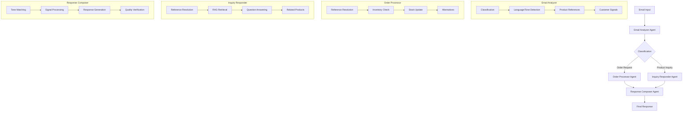

# Reference Solution Implementation Tracker

This reference solution was named Hermes (Human-like Email Responses for Magically Empathic Sales).

## Directory Structure

```
src/
├── __intro__.md              # Introduction to the notebook (comes first alphabetically)
├── config.py                 # Configuration using Pydantic BaseModel
├── state.py                  # State schema using dataclasses with Annotated fields
├── agents/
│   ├── README.md             # Introduction to the agents section
│   ├── email_classifier.py   # Email Analyzer Agent
│   ├── order_processor.py    # Order Processor Agent 
│   ├── inquiry_responder.py  # Inquiry Responder Agent
│   └── response_composer.py  # Response Composer Agent
├── prompts/
│   ├── README.md             # Introduction to the prompts
│   ├── email_classifier.py   # Prompts for Email Analyzer
│   ├── order_processor.py    # Prompts for Order Processor
│   ├── inquiry_responder.py  # Prompts for Inquiry Responder
│   └── response_composer.py  # Prompts for Response Composer
├── tools/
│   ├── README.md             # Introduction to the tools
│   ├── catalog_tools.py      # Product catalog/search tools
│   ├── order_tools.py        # Order processing and inventory tools
│   └── response_tools.py     # Response generation tools
├── vectorstore.py            # Vector store setup and retrieval functions
├── pipeline.py               # Main StateGraph workflow definition
├── output.py                 # Google Sheets integration
└── process_emails.py         # Main script demonstrating full workflow

tests/
├── __init__.py               # Test initialization with mocking utilities
├── fixtures/                 # Test fixtures and data
├── test_basic.py             # Basic import and configuration tests
├── test_email_classifier.py  # Tests for Email Analyzer Agent
├── test_inquiry_responder.py # Tests for Inquiry Responder Agent
├── test_integration.py       # End-to-end integration tests
├── test_order_processor.py   # Tests for Order Processor Agent
├── test_pipeline.py          # Tests for the main pipeline
├── test_response_composer.py # Tests for Response Composer Agent
└── run_tests.sh              # Shell script to run tests with configuration
```

## Agent Flow Diagram



## Notebook Organization

The final notebook will be structured by concatenating files in alphabetical order within each folder. Therefore:

1. Use `__intro__.md` at the root to start the notebook (alphabetically first)
2. Use `README.md` in each folder to introduce that section
3. Name files to ensure proper ordering when concatenated alphabetically
4. Use markdown-cell comments in Python files to provide explanations
5. Use code-cell blocks in markdown files for executable code

## Implementation Tasks

### 1. Setup Project Foundation

- [X] **Create Notebook Introduction** (ref: reference-solution-spec.md)
  - [X] Create `src/__intro__.md` with project overview, architecture diagram
  - [X] Explain overall approach and reference to assignment requirements

- [X] **Create Base Configuration** (ref: reference-solution-spec.md#1-configuration)
  - [X] Implement `src/config.py` with `HermesConfig` Pydantic model
  - [X] Include model parameters and vector store configuration
  - [X] Add `from_runnable_config` classmethod
  - [X] Add markdown-cell comments explaining design choices

- [X] **Define State Schema** (ref: reference-solution-spec.md#2-state-schema)
  - [X] Implement `src/state.py` with dataclasses and Annotated fields
  - [X] Create state fields for email, classification, order, inquiry, response
  - [X] Use appropriate reducer functions (e.g., add_messages)
  - [X] Add markdown-cell comments explaining the state design

### 2. Implement Core Tools

- [X] **Tools Introduction** (ref: reference-agent-flow.md#tools-and-utilities-for-agents)
  - [X] Create `src/tools/README.md` to introduce the tools section
  - [X] Explain the purpose and organization of the tools

- [X] **Product Catalog Tools** (ref: reference-agent-flow.md#product-catalog-tools)
  - [X] Implement `src/tools/catalog_tools.py` with:
    - [X] `find_product_by_id` tool
    - [X] `find_product_by_name` with fuzzy matching
    - [X] `search_products_by_description` for semantic search
    - [X] `find_related_products` function

- [X] **Inventory Management Tools** (ref: reference-agent-flow.md#inventory-management-tools)
  - [X] Implement `src/tools/order_tools.py` with:
    - [X] `check_stock` function
    - [X] `update_stock` function
    - [X] `find_alternatives_for_oos` function
    - [X] `extract_promotion` function

- [X] **Response Tools** (ref: reference-agent-flow.md#natural-language-processing-tools)
  - [X] Implement `src/tools/response_tools.py` with:
    - [X] `analyze_tone` function
    - [X] `extract_questions` function
    - [X] `generate_natural_response` function

### 3. Build Vector Store

- [X] **Create Vector Store** (ref: reference-solution-spec.md#6-vector-store--embeddings)
  - [X] Implement `src/vectorstore.py` with:
    - [X] Functions to create embeddings for products
    - [X] Setup ChromaDB with OpenAI embeddings
    - [X] Functions for similarity search with metadata filtering
    - [X] Category-based pre-filtering for efficiency

### 4. Implement Agent Prompts

- [X] **Prompts Introduction** (ref: reference-solution-spec.md#4-prompts)
  - [X] Create `src/prompts/README.md` to introduce the prompts section
  - [X] Explain the prompt design philosophy

- [X] **Email Analyzer Prompts** (ref: reference-agent-flow.md#1-email-analyzer-agent)
  - [X] Implement `src/prompts/email_classifier.py`
  - [X] Create ChatPromptTemplate with system and user messages
  - [X] Include few-shot examples for complex classification

- [X] **Order Processor Prompts** (ref: reference-agent-flow.md#2-order-processor-agent)
  - [X] Implement `src/prompts/order_processor.py`
  - [X] Create templates for processing orders and handling inventory

- [X] **Inquiry Responder Prompts** (ref: reference-agent-flow.md#3-inquiry-responder-agent)
  - [X] Implement `src/prompts/inquiry_responder.py`
  - [X] Create templates for detailed product information retrieval

- [X] **Response Composer Prompts** (ref: reference-agent-flow.md#4-response-composer-agent)
  - [X] Implement `src/prompts/response_composer.py`
  - [X] Incorporate customer signal processing guidance

### 5. Implement Agents

- [X] **Agents Introduction** (ref: reference-solution-spec.md#3-agents-nodes)
  - [X] Create `src/agents/README.md` to introduce the agents section
  - [X] Explain the agent architecture and responsibilities

- [X] **Email Analyzer Agent** (ref: reference-agent-flow.md#1-email-analyzer-agent)
  - [X] Implement `src/agents/email_classifier.py`
  - [X] Include models for ProductReference, CustomerSignal, ToneAnalysis, EmailAnalysis
  - [X] Add verification step for structured output
  - [X] Implement classification, language/tone detection, and signal extraction

- [X] **Order Processor Agent** (ref: reference-agent-flow.md#2-order-processor-agent)
  - [X] Implement `src/agents/order_processor.py`
  - [X] Include models for OrderItem, AlternativeProduct, OrderProcessingResult
  - [X] Add inventory management logic
  - [X] Implement verification functions

- [X] **Inquiry Responder Agent** (ref: reference-agent-flow.md#3-inquiry-responder-agent)
  - [X] Implement `src/agents/inquiry_responder.py`
  - [X] Include models for ProductInformation, QuestionAnswer, InquiryResponse
  - [X] Add RAG-based response generation
  - [X] Implement verification functions

- [X] **Response Composer Agent** (ref: reference-agent-flow.md#4-response-composer-agent)
  - [X] Implement `src/agents/response_composer.py`
  - [X] Include model for ResponseComposition
  - [X] Implement customer signal processing (ref: customer-signal-processing.md)
  - [X] Add verification functions for response quality

### 6. Build Graph and Process Emails

- [X] **Create Pipeline** (ref: reference-agent-flow.md#main-processing-flow)
  - [X] Implement `src/pipeline.py`
  - [X] Create StateGraph with appropriate state schema
  - [X] Add all agent nodes
  - [X] Configure edges with conditional routing
  - [X] Compile the workflow

- [X] **Create Main Processing Script** (ref: reference-agent-flow.md#processing-loop-for-all-emails)
  - [X] Implement `src/process_emails.py`
  - [X] Create function to load emails and product data
  - [X] Process each email through the workflow
  - [X] Collect and format results

### 7. Implement Output

- [X] **Google Sheets Integration** (ref: reference-solution-spec.md#8-outputintegration)
  - [X] Implement `src/output.py`
  - [X] Create functions to write results to Google Sheets
  - [X] Handle the required format for assignment outputs

### 8. Test and Validate

- [X] **Create Test Foundation** (ref: reference-solution-spec.md#9-testing--validation)
  - [X] Implement `tests/` directory with pytest structure
  - [X] Create test fixtures for products and emails data
  - [X] Setup utility functions for validation and assertions
  - [X] Add custom poethepoet tasks for running tests

- [ ] **Email Classifier Tests** (ref: hidden-evaluation-criteria.md#email-classification-complexity)
  - [ ] Implement `tests/test_email_classifier.py` with cases:
    - [X] Multi-language emails (E009: Spanish inquiry about "Gorro de punto grueso")
    - [X] Mixed intent emails (E019: Chelsea boots order + future sunglasses interest)
    - [X] Emails with vague references (E017: "that popular item you sell")
    - [X] Emails with missing subjects (E006, E017, E021)
    - [X] Emails with tangential information (E012: lawnmower/reservation mentions)

- [ ] **Order Processor Tests** (ref: hidden-evaluation-criteria.md#inventory-edge-cases)
  - [ ] Implement `tests/test_order_processor.py` with cases:
    - [X] Last item in stock (E010: RSG8901 with stock=1)
    - [X] Quantity exceeds stock (E018: 2 pairs of RSG8901 with stock=1)
    - [X] Complex reference formats (E019: "[CBT 89 01]" matching to CBT8901)
    - [X] Multiple item orders (E007: 5 beanies and 2 slippers)
    - [X] Products with promotions (E.g., orders with CBG9876 "Buy one, get one 50% off")

- [ ] **Inquiry Responder Tests** (ref: hidden-evaluation-criteria.md#seasonaloccasion-specific-inquiries)
  - [ ] Implement `tests/test_inquiry_responder.py` with cases:
    - [X] Seasonal inquiries (E020: Saddle bag suitable for spring)
    - [X] Occasion-specific inquiries (E016: dress for summer wedding)
    - [X] Material/quality questions (E005: CSH1098 material quality)
    - [X] Style/inspiration questions (E011: era inspiration for RSG8901)
    - [X] Multi-language inquiries (E009: Spanish, winter warmth question)

- [ ] **Response Composer Tests** (ref: hidden-evaluation-criteria.md#tonestyle-adaptation)
  - [ ] Implement `tests/test_response_composer.py` with cases:
    - [X] Formal tone adaptation (E005: "Good day" formal inquiry)
    - [X] Casual tone adaptation (E002: casual, chatty tone with personal details)
    - [X] Out-of-stock responses (E018: requesting 2 RSG8901 with stock=1)
    - [X] Promotional info inclusion (responses for products with promotions)
    - [X] Natural language generation (avoiding templated phrases)

- [ ] **Integration Tests** 
  - [ ] Implement `tests/test_integration.py` with end-to-end flows:
    - [X] Clear product inquiry flow (E011: sunglasses era question)
    - [X] Clear order request flow (E010: sunglasses order)
    - [X] Mixed intent flow (E019: boots order + future sunglasses interest)
    - [X] Non-English flow (E009: Spanish inquiry)
    - [X] Edge case flow (E017: vague "popular item" request)
    - [ ] Output format validation for all required spreadsheet formats

## Notebook Integration Guidelines

For creating files compatible with the `