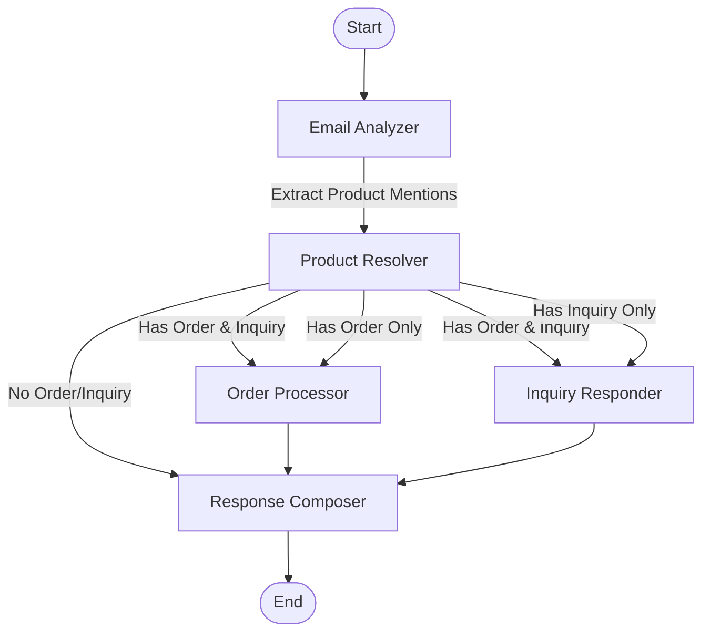

# Hermes Architecture Documentation

This folder contains comprehensive documentation of the Hermes system architecture. Hermes is an automated customer service system that processes incoming customer emails, analyzes them for intent, and generates appropriate responses for product inquiries and order requests.

## Documentation Index

- [System Overview](system-overview.md) - High-level architecture and data flow
- [Agents](agents.md) - Detailed description of each agent's responsibilities and components
- [Data Flow](data-flow.md) - Structured data models and transformation through the system
- [Workflow](workflow.md) - LangGraph workflow orchestration and state management
- [Tools](tools.md) - Utility tools used by agents for specific operations
- [LLM Integration](llm-integration.md) - Configuration and usage of language models
- [Infrastructure](infrastructure.md) - Core infrastructure components and data models

## System Flow Diagram



## Architecture Diagram

```
┌────────────────────────────────────────────────────────────────────────────┐
│                              Hermes System                                  │
│                                                                            │
│  ┌─────────┐     ┌─────────────┐     ┌─────────┐     ┌─────────────┐      │
│  │         │     │             │     │         │     │             │      │
│  │ Customer├────►│  Classifier ├────►│   Stock ├────►│   Fulfiller │      │
│  │  Email  │     │   (Analyze) │     │  keeper │     │    (Order)  │      │
│  │         │     │             │     │(Resolve)│     │             │      │
│  └─────────┘     └─────────────┘     └────┬────┘     └───────┬─────┘      │
│                                           │                  │            │
│                                           │                  │            │
│                                           │                  │            │
│                                           ▼                  │            │
│                                    ┌─────────────┐          │            │
│                                    │             │          │            │
│                                    │   Advisor   │          │            │
│                                    │  (Inquiry)  │          │            │
│                                    │             │          │            │
│                                    └───────┬─────┘          │            │
│                                            │                │            │
│                                            │                │            │
│                                            │                │            │
│                                            ▼                ▼            │
│                                    ┌─────────────────────────┐           │
│                                    │                         │           │
│                                    │       Composer          │           │
│                                    │   (Generate Response)   │           │
│                                    │                         │           │
│                                    └────────────┬────────────┘           │
│                                                 │                        │
│                                                 ▼                        │
│                                    ┌─────────────────────────┐           │
│                                    │                         │           │
│                                    │    Customer Response    │           │
│                                    │                         │           │
│                                    └─────────────────────────┘           │
│                                                                          │
└────────────────────────────────────────────────────────────────────────────┘
```

## Core Components

- **Classifier (Email Analyzer)**: Analyzes emails to determine intent and extract product mentions
- **Stockkeeper (Product Resolver)**: Resolves product mentions to actual products in the catalog
- **Advisor (Inquiry Responder)**: Handles product inquiries using RAG to provide factual answers
- **Fulfiller (Order Processor)**: Processes order requests, checking stock and applying promotions
- **Composer (Response Generator)**: Generates the final natural language response

## Key Architectural Principles

1. **Agent-based Architecture**: Specialized components with clearly defined responsibilities
2. **Directed Workflow**: Processing follows a directed graph with conditional routing
3. **Comprehensive State**: A shared state accumulates outputs throughout the workflow
4. **Tiered Model Strategy**: Different model strengths for different tasks
5. **Strong Typing**: Pydantic models enforce data validation throughout
6. **Error Resilience**: Structured error handling prevents cascade failures

## Technology Stack

- **LangChain**: Framework for LLM application development
- **LangGraph**: Directed graph-based workflow orchestration
- **Pydantic**: Data validation and settings management
- **ChromaDB**: Vector database for semantic search
- **OpenAI/Gemini**: Provider options for LLM capabilities 