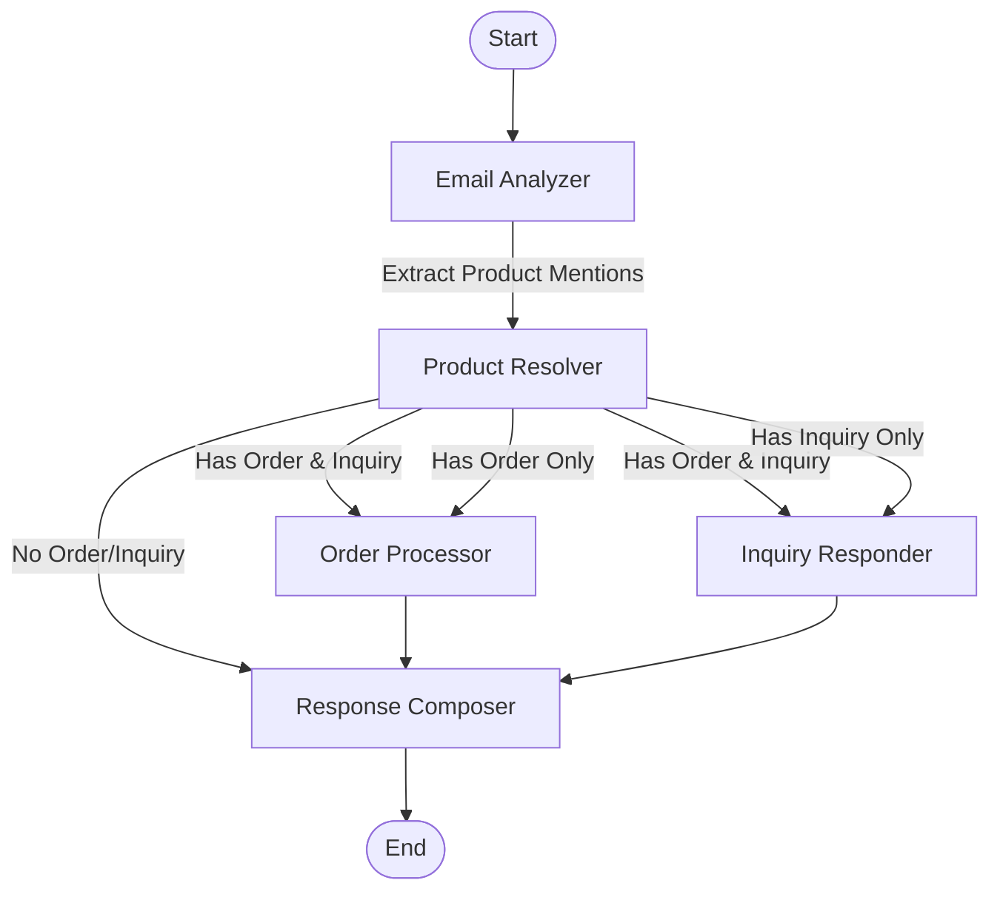

# Hermes System Architecture Overview

## Introduction

Hermes is an email processing system designed to automate customer service interactions, particularly for handling product inquiries and order requests. The system uses a modular, agent-based architecture powered by large language models (LLMs) to analyze, process, and respond to customer emails.

## System Architecture

Hermes follows a directed workflow architecture using LangGraph for orchestration. The system processes emails through a series of specialized agents, each performing a specific function in the workflow.

### Core Components

1. **Agent System**: A set of specialized agents that work together to process customer emails
   - **Classifier (Email Analyzer)** - Analyzes incoming emails to determine intent, extract product mentions, and segment the content
   - **Stockkeeper (Product Resolver)** - Resolves product mentions to actual products in the catalog
   - **Advisor (Inquiry Responder)** - Handles product inquiries using RAG to provide factual answers
   - **Fulfiller (Order Processor)** - Processes order requests, checking stock and applying promotions
   - **Composer (Response Generator)** - Generates the final natural language response

2. **Tools**: Utility functions that agents use to interact with product data, inventory, and promotions
3. **Models**: Data structures that define the shape of data flowing through the system
4. **Workflow**: LangGraph-based orchestration of the agent pipeline
5. **Vector Store**: ChromaDB-backed storage for semantic search of product information
6. **LLM Integration**: Flexible configuration for using either OpenAI or Google Gemini models

## Workflow Process

1. The system receives an email (with subject and message content)
2. The Email Analyzer classifies the intent and extracts product mentions
3. The Product Resolver matches mentions to actual catalog products
4. Conditional processing:
   - If order request: Order Processor handles fulfillment and stock updates
   - If product inquiry: Inquiry Responder provides product information
   - If both: Both processors handle their respective parts
5. The Response Composer generates the final customer response
6. The system outputs the results (classification, order status, and response)

## State Management

The system uses a comprehensive `OverallState` object that accumulates outputs from each agent as the workflow progresses. This state contains the complete history of the email processing, allowing each agent to access outputs from previous agents for contextual processing.

## Configuration

The system is configurable through a central `HermesConfig` class that manages:

1. LLM provider selection (OpenAI or Google Gemini)
2. Model selection (with "strong" and "weak" model tiers for different tasks)
3. API keys and endpoints
4. Vector store paths and collection names
5. Input/output spreadsheet IDs

## Key Design Patterns

1. **Agent-based Architecture**: Specialized components with clearly defined responsibilities
2. **Retrieval Augmented Generation (RAG)**: Used for product inquiries to ensure factual accuracy
3. **Workflow Orchestration**: LangGraph manages the state and flow between agents
4. **Structured Data**: Pydantic models ensure type safety and data consistency
5. **Tiered Model Strategy**: Different model strengths for different tasks
6. **Error Resilience**: Structured error handling prevents cascade failures

## Error Handling

Each component includes robust error handling with a standardized error response format. Errors are captured in the state and do not interrupt the workflow, allowing the system to gracefully handle partial failures.

## Output Generation

The final output of the system includes:
1. Email classification results 
2. Order status for processed items
3. Generated customer responses

These outputs can be saved to either CSV files or Google Sheets for further analysis.

## Technology Stack

- **LangChain**: Framework for LLM application development
- **LangGraph**: Directed graph-based workflow orchestration
- **Pydantic**: Data validation and settings management
- **ChromaDB**: Vector database for semantic search
- **OpenAI/Gemini**: Provider options for LLM capabilities 