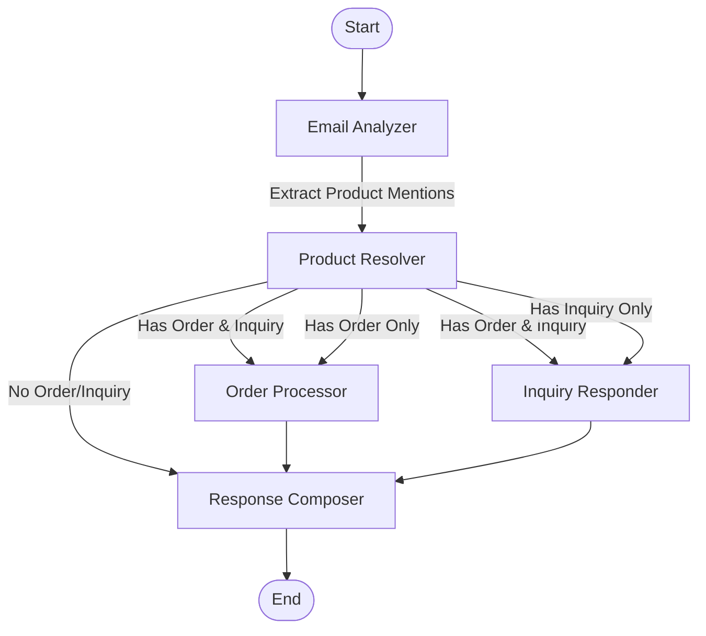

# Hermes Architecture Overview

This directory contains documentation on the architecture of the Hermes email processing system. The documents provide a comprehensive overview of how the system works, from high-level architecture to specific components.

## Documents

1. [System Overview](system-overview.md) - High-level overview of the Hermes system architecture
2. [Agents](agents.md) - Detailed description of each agent, their inputs, outputs, and responsibilities
3. [Tools](tools.md) - Overview of the utility tools used by agents for specific operations
4. [Models](models.md) - Documentation of the data models that structure the system's data flows
5. [Workflow](workflow.md) - Explanation of the LangGraph workflow implementation
6. [LLM Integration](llm-integration.md) - Details of how LLMs are integrated and configured

## System Flow Diagram

## Purpose of This Documentation

This documentation is designed to help senior developers understand the Hermes system architecture for evaluation purposes. It focuses on:

1. The overall process flow and component interactions
2. The responsibilities of each component
3. The data formats and transformations
4. The integration with Large Language Models (LLMs)

For implementation details, please refer to the source code in the corresponding directories.

## Key Architectural Principles

1. **Separation of Concerns**: Each agent and tool has a specific, focused responsibility
2. **Directed Workflow**: Processing follows a directed graph with conditional routing
3. **Comprehensive State**: A shared state accumulates outputs throughout the workflow
4. **Tiered Model Strategy**: Different model strengths for different tasks
5. **Strong Typing**: Pydantic models enforce data validation throughout
6. **Error Resilience**: Structured error handling prevents cascade failures

## Technology Stack

- **LangChain**: Framework for LLM application development
- **LangGraph**: Directed graph-based workflow orchestration
- **Pydantic**: Data validation and settings management
- **ChromaDB**: Vector database for semantic search
- **OpenAI/Gemini**: Provider options for LLM capabilities 