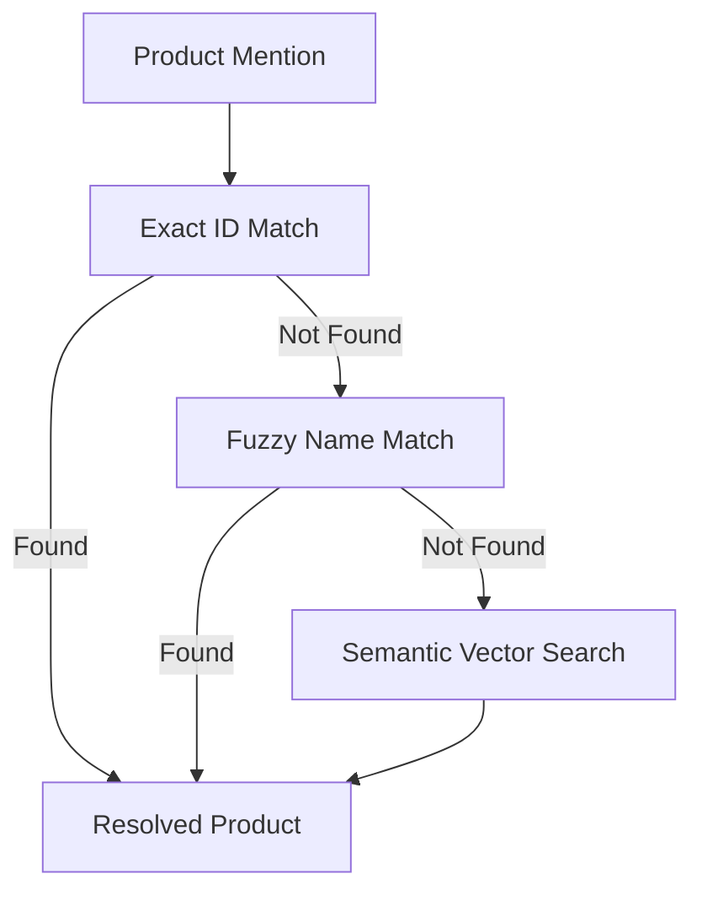

# Advanced AI Techniques

The Hermes system demonstrates sophisticated use of advanced AI techniques, particularly **Retrieval-Augmented Generation (RAG)** and **tiered model strategies**, addressing the core evaluation criteria for advanced AI implementation.

## Retrieval-Augmented Generation (RAG)

### 1. Vector Store Implementation

Hermes implements a production-grade RAG system using **ChromaDB** for semantic search:

```python
# Vector store initialization for scalable product search
class VectorStore:
    def __init__(self, hermes_config: HermesConfig):
        self.collection = chroma_client.get_or_create_collection(
            name=hermes_config.vector_store_collection_name,
            embedding_function=OpenAIEmbeddingFunction(
                api_key=hermes_config.openai_api_key,
                model_name="text-embedding-3-small"
            )
        )
```

**Key Features**:
- **Semantic embeddings** using OpenAI's `text-embedding-3-small` model
- **Lazy collection loading** for efficient memory usage
- **Scalable to 100,000+ products** without token limitations
- **Fast similarity search** using vector distance calculations

### 2. Multi-Strategy Product Resolution

The Product Resolver implements a **cascading resolution strategy** combining exact, fuzzy, and semantic matching:



**Implementation Details**:
1. **Exact matching**: Direct product ID references (confidence: 1.0)
2. **Fuzzy matching**: Handle typos and variations using string similarity
3. **Semantic search**: Vector similarity for description-based matching

### 3. Context-Aware Information Retrieval

The RAG system provides **contextual product information** based on customer queries:

```python
def semantic_search_products(
    query: str, 
    top_k: int = 5,
    similarity_threshold: float = 0.7
) -> list[Product]:
    """Perform semantic search for products using vector similarity."""
    results = vector_store.collection.query(
        query_texts=[query],
        n_results=top_k,
        where={"similarity": {"$gte": similarity_threshold}}
    )
    return parse_vector_results(results)
```

**Benefits**:
- **Handles natural language queries** effectively
- **Finds semantically related products** beyond keyword matching
- **Maintains relevance** through similarity thresholds
- **Scales efficiently** for large product catalogs

## Tiered Model Strategy

### 1. Model Tier Classification

Hermes employs a **cost-optimized model strategy** using different LLM capabilities for different tasks:

| Task Type | Model Tier | Example Models | Use Case |
|-----------|------------|----------------|----------|
| **Structured Extraction** | Weak | GPT-3.5-turbo, Gemini-1.5-flash | Email classification, product mention extraction |
| **Complex Reasoning** | Strong | GPT-4o, Gemini-1.5-pro | Natural language generation, contextual responses |
| **Embedding Generation** | Specialized | text-embedding-3-small | Vector embeddings for semantic search |

### 2. Strategic Model Assignment

```python
class HermesConfig:
    # Weak models for structured tasks
    weak_model: str = "gpt-3.5-turbo"  # Classification, extraction
    
    # Strong models for generation tasks  
    strong_model: str = "gpt-4o"       # Response composition
    
    # Specialized embedding model
    embedding_model: str = "text-embedding-3-small"
```

**Optimization Benefits**:
- **Cost efficiency**: Use expensive models only where necessary
- **Performance balance**: Match model capability to task complexity
- **Token conservation**: Optimize quota usage across tasks

### 3. Task-Specific Model Usage

| Agent | Model Tier | Justification |
|-------|------------|---------------|
| **Email Analyzer** | Weak | Structured classification task |
| **Product Resolver** | Weak + Embedding | Simple matching + vector search |
| **Order Processor** | Weak | Structured order processing |
| **Inquiry Responder** | Strong | Complex reasoning over product data |
| **Response Composer** | Strong | Natural language generation |

## Advanced Prompt Engineering

### 1. Structured Output Prompts

Hermes uses **sophisticated prompt engineering** for consistent, structured outputs:

```python
CLASSIFIER_PROMPT = """
You are an email classification specialist. Analyze the email and provide structured output.

IMPORTANT: Respond ONLY with valid JSON matching this exact schema:
{
    "email_id": "string",
    "language": "string", 
    "primary_intent": "product inquiry" | "order request",
    "segments": [
        {
            "segment_type": "order" | "inquiry" | "personal_statement" | "other",
            "content": "string",
            "product_mentions": [...]
        }
    ]
}
"""
```

**Prompt Engineering Techniques**:
- **Schema-driven responses** ensuring consistent output format
- **Few-shot examples** improving classification accuracy
- **Constraint specification** preventing hallucination
- **Task-specific instructions** optimizing for each agent's role

### 2. RAG-Enhanced Prompts

The Inquiry Responder uses **retrieval-augmented prompts** for factual accuracy:

```python
ADVISOR_PROMPT = """
You are a product expert. Answer customer questions using ONLY the provided product information.

RETRIEVED PRODUCTS:
{retrieved_products}

CUSTOMER QUESTIONS:
{customer_questions}

Rules:
1. Base answers ONLY on provided product data
2. If information is missing, state "Information not available"
3. Reference specific products when relevant
4. Maintain professional, helpful tone
"""
```

**RAG Prompt Benefits**:
- **Factual grounding**: Responses based on actual product data
- **Hallucination prevention**: Explicit constraints on information source
- **Context awareness**: Tailored responses using retrieved information
- **Accuracy validation**: Clear source attribution for all claims

## Machine Learning Integration

### 1. Embedding Model Integration

The system leverages **state-of-the-art embedding models** for semantic understanding:

```python
def generate_product_embeddings(products: list[Product]) -> None:
    """Generate and store embeddings for product catalog."""
    for product in products:
        # Create rich text representation
        product_text = f"{product.name} {product.description} {product.category}"
        
        # Generate embedding using OpenAI's model
        embedding = embedding_function([product_text])
        
        # Store in vector database
        vector_store.add_documents(
            documents=[product_text],
            metadatas=[product.model_dump()],
            ids=[product.product_id]
        )
```

### 2. Similarity Computation

Advanced **similarity metrics** for accurate product matching:

```python
def compute_semantic_similarity(
    query_embedding: list[float],
    product_embeddings: list[list[float]]
) -> list[float]:
    """Compute cosine similarity between query and products."""
    return cosine_similarity([query_embedding], product_embeddings)[0]
```

## Advanced Features

### 1. Parallel Agent Execution

For mixed-intent emails, the system executes **multiple agents in parallel**:

```python
# LangGraph conditional routing for parallel execution
graph_builder.add_conditional_edges(
    Nodes.STOCKKEEPER,
    route_resolver_result,
    {
        "inquiry_only": Nodes.ADVISOR,
        "order_only": Nodes.FULFILLER, 
        "mixed_intent": [Nodes.FULFILLER, Nodes.ADVISOR]  # Parallel execution
    }
)
```

### 2. Context-Aware Processing

Each agent has access to **accumulated context** from previous agents:

```python
class OverallState(BaseModel):
    # Input
    email_id: str
    message: str
    
    # Accumulated outputs
    classifier: ClassifierOutput | None = None
    stockkeeper: StockkeeperOutput | None = None
    fulfiller: FulfillerOutput | None = None
    advisor: AdvisorOutput | None = None
    composer: ComposerOutput | None = None
```

### 3. Error-Resilient Processing

The system maintains **graceful degradation** with comprehensive error handling:

```python
def create_node_response(
    agent_name: str,
    state: OverallState,
    process_func: Callable,
    config: dict
) -> OverallState:
    """Wrapper providing error isolation for agent execution."""
    try:
        return process_func(state, config)
    except Exception as e:
        # Log error without stopping workflow
        state.errors[agent_name] = Error(message=str(e), source=agent_name)
        return state
```

## Performance Optimizations

### 1. Lazy Loading
- **Vector collections** loaded only when needed
- **Product catalogs** cached for repeated access
- **LLM clients** initialized once per configuration

### 2. Batch Processing
- **Multiple product embeddings** generated in batches
- **Bulk vector operations** for efficient similarity search
- **Parallel API calls** where supported

### 3. Caching Strategies
- **Vector embeddings** cached between runs
- **Product resolution results** memoized for repeated queries
- **LLM responses** cached for identical inputs

This sophisticated implementation of advanced AI techniques demonstrates deep understanding of modern LLM application patterns, positioning Hermes as a production-grade solution that effectively addresses the assignment's advanced AI requirements. 