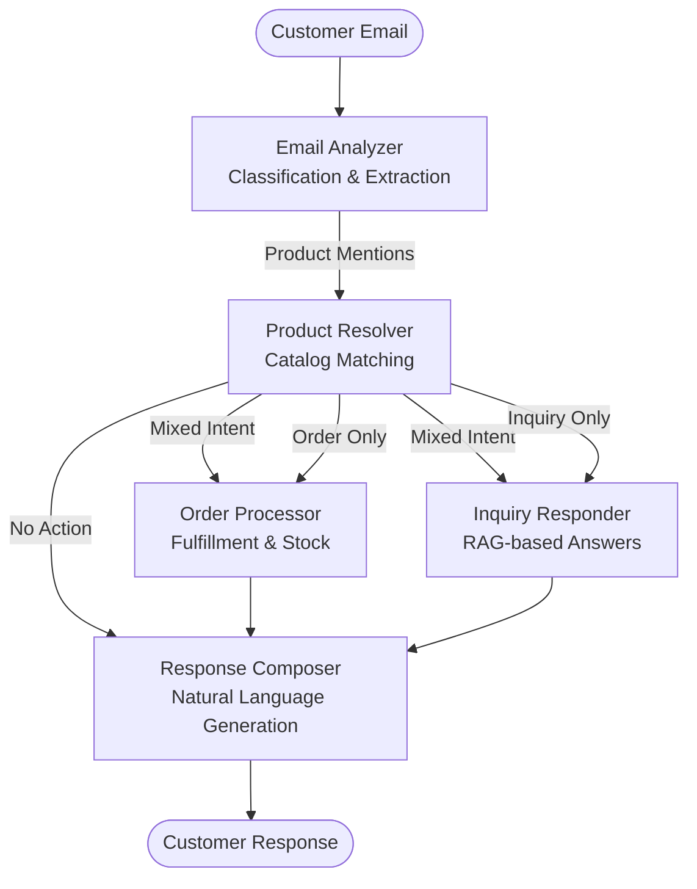

# System Architecture Overview

## High-Level Architecture

Hermes implements a sophisticated **agent-based architecture** using LangGraph for workflow orchestration. The system processes customer emails through a directed graph of specialized agents, each optimized for specific aspects of customer service automation.



## Core Design Principles

### 1. Agent Specialization
Each agent has a **single, well-defined responsibility** with clear input/output contracts:

- **Email Analyzer**: Intent classification and product mention extraction
- **Product Resolver**: Catalog matching using multiple strategies
- **Order Processor**: Fulfillment, stock management, and promotions
- **Inquiry Responder**: RAG-based product information retrieval
- **Response Composer**: Natural language response generation

### 2. Directed Workflow
The system uses **LangGraph** to implement a directed acyclic graph (DAG) with:
- **Conditional routing** based on email intent
- **Parallel processing** for mixed-intent communications
- **State accumulation** throughout the workflow
- **Error isolation** preventing cascade failures

### 3. Comprehensive State Management
A central `OverallState` object tracks the complete email processing journey:
- Agent outputs are accumulated as the workflow progresses
- Each agent has access to previous results for contextual processing
- Error tracking maintains system resilience
- Type-safe state transitions ensure data integrity

## Component Architecture

### Agent Layer
```
┌─────────────────────────────────────────────────────────────┐
│                     Agent Layer                            │
├─────────────┬─────────────┬─────────────┬─────────────────┤
│   Email     │   Product   │    Order    │     Inquiry     │
│  Analyzer   │  Resolver   │  Processor  │   Responder     │
│             │             │             │                 │
│ • Intent    │ • Exact     │ • Stock     │ • RAG Search   │
│   Analysis  │   Matching  │   Check     │ • Product      │
│ • Product   │ • Fuzzy     │ • Inventory │   Retrieval    │
│   Mentions  │   Search    │   Update    │ • Factual      │
│ • Segment   │ • Semantic  │ • Promotion │   Answers      │
│   Extract   │   Vectors   │   Apply     │                │
└─────────────┴─────────────┴─────────────┴─────────────────┘
```

### Tool Layer
```
┌─────────────────────────────────────────────────────────────┐
│                     Tool Layer                             │
├─────────────┬─────────────┬─────────────┬─────────────────┤
│  Product    │   Order     │ Promotion   │    Vector       │
│   Tools     │   Tools     │   Tools     │    Store        │
│             │             │             │                 │
│ • Search    │ • Stock     │ • Apply     │ • Semantic      │
│ • Resolve   │   Check     │   Rules     │   Search        │
│ • Match     │ • Update    │ • Calculate │ • Similarity    │
│             │   Inventory │   Discount  │   Matching      │
└─────────────┴─────────────┴─────────────┴─────────────────┘
```

### Data Layer
```
┌─────────────────────────────────────────────────────────────┐
│                     Data Layer                             │
├─────────────┬─────────────┬─────────────┬─────────────────┤
│  Product    │   Order     │    Email    │     Vector      │
│  Catalog    │  Processing │  Analysis   │    Embeddings   │
│             │             │             │                 │
│ • Products  │ • Orders    │ • Intent    │ • Product       │
│ • Stock     │ • Lines     │ • Segments  │   Vectors       │
│ • Pricing   │ • Status    │ • Mentions  │ • ChromaDB      │
│ • Promotions│             │             │                 │
└─────────────┴─────────────┴─────────────┴─────────────────┘
```

## Advanced Features

### 1. Intelligent Routing
The workflow implements sophisticated routing logic:
- **Intent-based branching**: Routes to appropriate agents based on email classification
- **Parallel execution**: Processes orders and inquiries simultaneously for mixed-intent emails
- **Graceful fallbacks**: Handles edge cases and errors without breaking the workflow

### 2. Multi-Strategy Product Resolution
The Product Resolver employs a **cascade of matching strategies**:
1. **Exact ID matching**: Direct product ID references
2. **Fuzzy name matching**: Handles typos and variations
3. **Semantic vector search**: Contextual product description matching

### 3. Tiered Model Strategy
The system optimizes LLM usage through model tiers:
- **Strong models** (GPT-4): Complex reasoning, natural language generation
- **Weak models** (GPT-3.5): Structured tasks, classification, extraction

### 4. RAG Implementation
The Inquiry Responder implements production-grade RAG:
- **Vector embeddings** for product descriptions
- **Semantic search** for relevant product retrieval
- **Context-aware generation** grounded in product facts
- **Scalable to 100,000+ products** without token limitations

## Scalability & Performance

### 1. Vector Store Efficiency
- **ChromaDB integration** for fast semantic search
- **Lazy loading** of vector collections
- **Efficient similarity matching** for large catalogs

### 2. Parallel Processing
- **Concurrent agent execution** for mixed-intent emails
- **Asynchronous workflow** supporting high throughput
- **Resource optimization** through tiered model usage

### 3. Error Resilience
- **Isolated error handling** prevents cascade failures
- **Graceful degradation** maintains partial functionality
- **Comprehensive error tracking** for debugging and monitoring

## Integration Points

### 1. LLM Providers
- **Multi-provider support**: OpenAI and Google Gemini
- **Consistent interface** through LangChain abstractions
- **Configuration-driven** provider selection

### 2. Data Sources
- **Google Sheets integration** for product catalogs and email data
- **CSV export capabilities** for results
- **Flexible data loading** supporting various formats

### 3. Output Generation
- **Structured output formats** matching assignment requirements
- **Google Sheets integration** for automated result publishing
- **Type-safe data serialization** ensuring output consistency

## Security & Reliability

### 1. Type Safety
- **Pydantic models** enforce data validation throughout the system
- **Strong typing** prevents runtime errors
- **Input validation** ensures data integrity

### 2. Configuration Management
- **Centralized configuration** through `HermesConfig`
- **Environment-based settings** for different deployment scenarios
- **Secure API key management**

### 3. Error Handling
- **Comprehensive exception handling** at every layer
- **Structured error responses** for consistent debugging
- **Failure isolation** maintains system stability

This architecture demonstrates sophisticated understanding of modern LLM application design, implementing production-grade patterns for scalability, reliability, and maintainability. 