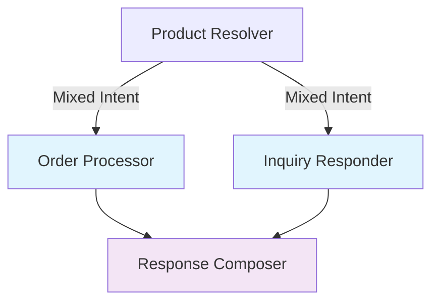

# Workflow Engine: LangGraph Implementation

The Hermes system leverages **LangGraph** to implement a sophisticated workflow engine that orchestrates email processing through a directed graph of specialized agents. This implementation demonstrates advanced understanding of modern LLM application orchestration patterns.

## LangGraph Architecture

### 1. StateGraph Foundation

Hermes uses LangGraph's `StateGraph` to implement a **directed acyclic graph (DAG)** with type-safe state management:

```python
from langgraph.graph import StateGraph, START, END
from langgraph.graph.state import CompiledStateGraph

# Initialize the state graph with comprehensive state management
graph_builder = StateGraph(
    state_schema=OverallState,
    input=ClassifierInput,
    config_schema=HermesConfig
)
```

**Key Features**:
- **Type-safe state transitions** using Pydantic models
- **Input/output contracts** clearly defined for each node
- **Configuration injection** for runtime customization
- **Comprehensive state accumulation** throughout the workflow

### 2. Node Definition and Registration

Each agent is registered as a **node** in the workflow graph:

```python
class Nodes:
    """Node identifiers for the workflow graph."""
    CLASSIFIER = "classifier"
    STOCKKEEPER = "stockkeeper"
    FULFILLER = "fulfiller"
    ADVISOR = "advisor"
    COMPOSER = "composer"

# Register agent functions as nodes
graph_builder.add_node(Nodes.CLASSIFIER, analyze_email_node)
graph_builder.add_node(Nodes.STOCKKEEPER, resolve_products_node)
graph_builder.add_node(Nodes.FULFILLER, process_order_node)
graph_builder.add_node(Nodes.ADVISOR, respond_to_inquiry_node)
graph_builder.add_node(Nodes.COMPOSER, compose_response_node)
```

### 3. Edge Configuration

The workflow implements **conditional routing** with both static and dynamic edges:

```python
# Static edges for guaranteed flow
graph_builder.add_edge(START, Nodes.CLASSIFIER)
graph_builder.add_edge(Nodes.CLASSIFIER, Nodes.STOCKKEEPER)
graph_builder.add_edge(Nodes.FULFILLER, Nodes.COMPOSER)
graph_builder.add_edge(Nodes.ADVISOR, Nodes.COMPOSER)
graph_builder.add_edge(Nodes.COMPOSER, END)

# Conditional edges for intelligent routing
graph_builder.add_conditional_edges(
    source=Nodes.STOCKKEEPER,
    path=route_resolver_result,
    path_map={
        "inquiry_only": Nodes.ADVISOR,
        "order_only": Nodes.FULFILLER,
        "mixed_intent": [Nodes.FULFILLER, Nodes.ADVISOR],  # Parallel execution
        "no_action": Nodes.COMPOSER
    }
)
```

## Conditional Routing Implementation

### 1. Intelligent Path Selection

The routing function analyzes email intent to determine the optimal processing path:

```python
def route_resolver_result(state: OverallState) -> str | list[str]:
    """Route after product resolution based on email intents."""
    
    if not state.classifier or not state.classifier.email_analysis:
        return "no_action"
    
    analysis = state.classifier.email_analysis
    
    # Route based on primary intent and segment analysis
    if analysis.primary_intent == "product inquiry":
        return "inquiry_only"
    elif analysis.primary_intent == "order request":
        if analysis.has_inquiry():
            return ["order_only", "inquiry_only"]  # Parallel processing
        else:
            return "order_only"
    elif analysis.has_order() and analysis.has_inquiry():
        return ["order_only", "inquiry_only"]  # Mixed intent
    elif analysis.has_order():
        return "order_only"
    elif analysis.has_inquiry():
        return "inquiry_only"
    else:
        return "no_action"
```

**Routing Strategies**:
- **Single path**: For emails with clear, single intent
- **Parallel paths**: For mixed-intent emails requiring both order processing and inquiry responses
- **Fallback path**: For emails requiring no specific processing

### 2. Parallel Execution

The system supports **concurrent agent execution** for maximum efficiency:



## State Management

### 1. Comprehensive State Schema

The `OverallState` accumulates outputs from each agent:

```python
class OverallState(BaseModel):
    """Comprehensive state tracking the complete email processing journey."""
    
    # Input fields
    email_id: str = Field(description="Unique email identifier")
    subject: str | None = Field(default=None, description="Email subject")
    message: str = Field(description="Email content")
    
    # Agent outputs (accumulated as workflow progresses)
    classifier: ClassifierOutput | None = None
    stockkeeper: StockkeeperOutput | None = None
    fulfiller: FulfillerOutput | None = None
    advisor: AdvisorOutput | None = None
    composer: ComposerOutput | None = None
    
    # Error tracking with merge strategy
    errors: Annotated[dict[Agents, Error], merge_errors] = Field(default_factory=dict)
    
    @property
    def is_complete(self) -> bool:
        """Check if the workflow has completed successfully."""
        return self.composer is not None
    
    @property
    def has_errors(self) -> bool:
        """Check if any errors occurred during processing."""
        return len(self.errors) > 0
```

### 2. State Merging Strategies

LangGraph supports **custom merge strategies** for state fields:

```python
def merge_errors(left: dict[Agents, Error], right: dict[Agents, Error]) -> dict[Agents, Error]:
    """Merge error dictionaries, preserving all errors."""
    merged = left.copy()
    merged.update(right)
    return merged

# Applied to the errors field
errors: Annotated[dict[Agents, Error], merge_errors] = Field(default_factory=dict)
```

### 3. State Validation

Each state transition includes **automatic validation**:

```python
def validate_state_transition(
    previous_state: OverallState,
    new_state: OverallState,
    node_name: str
) -> None:
    """Validate that state transitions are logical and complete."""
    
    # Ensure email ID consistency
    assert previous_state.email_id == new_state.email_id
    
    # Validate agent output presence
    if node_name == Nodes.CLASSIFIER:
        assert new_state.classifier is not None
    elif node_name == Nodes.STOCKKEEPER:
        assert new_state.stockkeeper is not None
    
    # Validate no data loss
    assert new_state.message == previous_state.message
```

## Node Wrapper Implementation

### 1. Agent Function Wrappers

Each agent function is wrapped to integrate with the LangGraph state management:

```python
def analyze_email_node(
    state: OverallState,
    config: RunnableConfig,
) -> OverallState:
    """Node wrapper for the email analyzer agent."""
    
    try:
        # Extract configuration
        hermes_config = HermesConfig.from_runnable_config(config)
        
        # Create agent input from state
        classifier_input = ClassifierInput(
            email_id=state.email_id,
            subject=state.subject or "",
            message=state.message
        )
        
        # Execute agent function
        result = analyze_email(classifier_input, config)
        
        # Update state with result
        state.classifier = result
        
    except Exception as e:
        # Capture errors without breaking workflow
        error = Error(
            message=str(e),
            source=Agents.CLASSIFIER,
            timestamp=datetime.now()
        )
        state.errors[Agents.CLASSIFIER] = error
        
        # Log error for debugging
        logger.error(f"Error in {Nodes.CLASSIFIER}: {e}")
    
    return state
```

### 2. Error Isolation

The wrapper pattern provides **error isolation** between agents:

```python
def create_node_wrapper(
    agent_function: Callable,
    agent_name: str,
    input_transformer: Callable[[OverallState], Any],
    output_transformer: Callable[[OverallState, Any], OverallState]
) -> Callable[[OverallState, RunnableConfig], OverallState]:
    """Generic node wrapper factory for consistent error handling."""
    
    def wrapper(state: OverallState, config: RunnableConfig) -> OverallState:
        try:
            # Transform state to agent input
            agent_input = input_transformer(state)
            
            # Execute agent
            result = agent_function(agent_input, config)
            
            # Transform and merge result back to state
            return output_transformer(state, result)
            
        except Exception as e:
            # Isolate error to this agent
            state.errors[agent_name] = Error(
                message=str(e),
                source=agent_name,
                timestamp=datetime.now()
            )
            return state
    
    return wrapper
```

## Workflow Execution

### 1. Asynchronous Execution

The workflow supports **asynchronous execution** for high performance:

```python
async def run_workflow(
    input_data: ClassifierInput,
    hermes_config: HermesConfig,
) -> OverallState:
    """Execute the complete workflow asynchronously."""
    
    # Initialize dependencies
    VectorStore(hermes_config=hermes_config)
    
    # Prepare runnable configuration
    config: RunnableConfig = {
        "configurable": {
            "hermes_config": hermes_config,
        }
    }
    
    # Execute workflow
    try:
        result = await workflow.ainvoke(input_data, config=config)
        
        # Validate result
        if isinstance(result, dict):
            final_state = OverallState.model_validate(result)
        else:
            final_state = result
            
        return final_state
        
    except Exception as e:
        # Create error state for workflow-level failures
        error_state = OverallState(
            email_id=input_data.email_id,
            subject=input_data.subject,
            message=input_data.message
        )
        error_state.errors["workflow"] = Error(
            message=f"Workflow execution failed: {str(e)}",
            source="workflow",
            timestamp=datetime.now()
        )
        return error_state
```

### 2. Batch Processing

The workflow can process **multiple emails in parallel**:

```python
async def process_batch(
    emails: list[ClassifierInput],
    hermes_config: HermesConfig,
    max_concurrent: int = 10
) -> list[OverallState]:
    """Process multiple emails concurrently with rate limiting."""
    
    semaphore = asyncio.Semaphore(max_concurrent)
    
    async def process_single(email_input: ClassifierInput) -> OverallState:
        async with semaphore:
            return await run_workflow(email_input, hermes_config)
    
    # Execute all workflows concurrently
    tasks = [process_single(email) for email in emails]
    results = await asyncio.gather(*tasks, return_exceptions=True)
    
    # Handle any exceptions
    final_results = []
    for i, result in enumerate(results):
        if isinstance(result, Exception):
            # Create error state for failed email
            error_state = OverallState(
                email_id=emails[i].email_id,
                subject=emails[i].subject,
                message=emails[i].message
            )
            error_state.errors["batch_processing"] = Error(
                message=str(result),
                source="batch_processing",
                timestamp=datetime.now()
            )
            final_results.append(error_state)
        else:
            final_results.append(result)
    
    return final_results
```

## Advanced Features

### 1. Workflow Visualization

LangGraph provides **built-in visualization** for debugging and monitoring:

```python
# Generate workflow diagram
workflow_image = workflow.get_graph().draw_mermaid_png()

# Save for documentation
with open("workflow_diagram.png", "wb") as f:
    f.write(workflow_image)
```

### 2. State Checkpointing

The workflow supports **state persistence** for debugging and recovery:

```python
from langgraph.checkpoint.memory import MemorySaver

# Add checkpointing to workflow
checkpointer = MemorySaver()
workflow = graph_builder.compile(checkpointer=checkpointer)

# Execute with thread ID for state tracking
config = {
    "configurable": {
        "thread_id": f"email_{input_data.email_id}",
        "hermes_config": hermes_config
    }
}

result = await workflow.ainvoke(input_data, config=config)
```

### 3. Dynamic Configuration

The workflow accepts **runtime configuration** for different scenarios:

```python
# Development configuration
dev_config = HermesConfig(
    weak_model="gpt-3.5-turbo",
    strong_model="gpt-4o",
    llm_provider="openai"
)

# Production configuration
prod_config = HermesConfig(
    weak_model="gpt-4o-mini",
    strong_model="gpt-4o",
    llm_provider="openai",
    vector_store_path="/prod/vector_store"
)

# Execute with appropriate configuration
result = await run_workflow(input_data, prod_config)
```

## Performance Optimizations

### 1. Parallel Agent Execution

The conditional routing enables **true parallel processing**:

```python
# When both order and inquiry processing are needed
if analysis.has_order() and analysis.has_inquiry():
    # Both agents execute simultaneously
    return [Nodes.FULFILLER, Nodes.ADVISOR]
```

### 2. Lazy State Loading

State components are loaded **only when needed**:

```python
@property
def stockkeeper_products(self) -> list[Product]:
    """Lazy loading of resolved products."""
    if not self.stockkeeper:
        return []
    return self.stockkeeper.resolved_products
```

### 3. Efficient Error Handling

Errors don't break the workflow but are **accumulated for analysis**:

```python
def has_critical_errors(self) -> bool:
    """Check for errors that prevent successful completion."""
    critical_agents = [Agents.CLASSIFIER, Agents.COMPOSER]
    return any(agent in self.errors for agent in critical_agents)
```

This sophisticated workflow engine implementation demonstrates deep understanding of modern orchestration patterns, providing a robust, scalable, and maintainable foundation for the Hermes email processing system. 