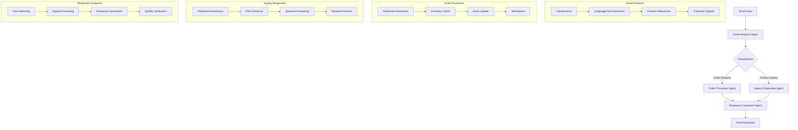

# Hermes: AI Email Processing Solution

## 1. Project Overview

This project, codenamed "Hermes" (Human-like Email Responses for Magically Empathic Sales), serves as a reference solution for an interview assignment focused on solving business problems with AI. The primary objective is to develop a proof-of-concept application that intelligently processes email order requests and customer inquiries for a fashion store. The system must accurately categorize emails, manage orders based on product availability, and generate appropriate, context-aware responses using a product catalog and current stock status.

The solution emphasizes the use of advanced Large Language Models (LLMs), Retrieval-Augmented Generation (RAG), and vector store techniques to handle complex tasks, process data efficiently, and generate high-quality outputs, as stipulated in the assignment.

## 2. System Architecture

The Hermes system is built upon a multi-agent architecture orchestrated by LangGraph. This design promotes separation of concerns, modularity, and robust error handling. The core components include:



**Agent Responsibilities:**

1.  **Email Analyzer Agent**: Receives raw email content. Its tasks include:
    *   Classifying the email's primary intent (e.g., "order request" or "product inquiry").
    *   Detecting the language and analyzing the tone of the email.
    *   Extracting explicit and implicit product references.
    *   Identifying customer signals (e.g., purchase intent, sentiment, context) based on the `customer-signal-processing.md` guide.
    *   Outputting a structured analysis.

2.  **Order Processor Agent**: Handles emails classified as "order request". Its tasks include:
    *   Resolving product references against the catalog.
    *   Checking product availability in the inventory.
    *   Updating stock levels for fulfilled orders.
    *   Suggesting alternatives for out-of-stock items.
    *   Generating a structured summary of the order status.

3.  **Inquiry Responder Agent**: Handles emails classified as "product inquiry". Its tasks include:
    *   Resolving product references.
    *   Using Retrieval-Augmented Generation (RAG) with a vector store of the product catalog to find relevant information.
    *   Answering customer questions based on retrieved product details.
    *   Suggesting related or complementary products.
    *   Outputting structured information for response generation.

4.  **Response Composer Agent**: Generates the final email response to the customer. Its tasks include:
    *   Synthesizing information from the preceding agents (email analysis, order status, inquiry answers).
    *   Adapting the response tone to match the customer's communication style and detected signals.
    *   Incorporating any relevant promotions or alternatives.
    *   Ensuring the response is professional, empathetic, and production-ready.
    *   Performing a quality verification check on the generated response.

## 3. Overall Approach

This solution is implemented in Python, leveraging modern AI and LLM libraries and best practices as outlined in the `reference-solution-spec.md` and `assignment-q&a.md`.

Key aspects of the approach include:

*   **LangGraph for Orchestration**: The multi-agent workflow is defined and managed using LangGraph, allowing for complex, stateful interactions and conditional logic.
*   **Pydantic for Data Modeling**: All data structures, agent inputs/outputs, and configuration parameters are defined using Pydantic models (`src/config.py`, `src/state.py`, and within agent modules). This ensures type safety, validation, and clear data contracts.
*   **Specialized Agents**: Each agent has a focused responsibility, making the system modular and easier to develop, test, and maintain (`src/agents/`).
*   **Structured Prompts**: Prompts for LLM interactions are carefully engineered and stored as `ChatPromptTemplate` instances, often including system messages and few-shot examples for optimal performance (`src/prompts/`).
*   **Tool-Using Agents**: Agents utilize tools (defined in `src/tools/`) for specific actions like database lookups, inventory checks, or RAG-based product information retrieval. Tools are implemented as functions decorated with `@tool` from LangChain.
*   **Vector Store for RAG**: A vector store (ChromaDB with OpenAI embeddings) is used to index the product catalog, enabling efficient semantic search for product inquiries and reference resolution (`src/vectorstore.py`). This addresses the scalability requirement for large product catalogs.
*   **Customer Signal Processing**: The system incorporates logic to detect and act upon various customer signals (e.g., intent, tone, context) to generate more personalized and effective responses, as detailed in `customer-signal-processing.md`.
*   **State Management**: A TypedDict with Annotated fields (`src/state.py`) is used to manage the shared state across the LangGraph pipeline, ensuring data flows correctly between agents.
*   **Output Generation**: The solution will generate outputs in the specified spreadsheet format (`src/output.py`), compatible with Google Sheets.

## 4. Addressing Assignment Requirements

This reference solution is designed to meet all explicit and implicit requirements of the `assignment-instructions.md`:

1.  **Email Classification**: The `Email Analyzer Agent` classifies emails into "product inquiry" or "order request". The results are prepared for the `email-classification` sheet.
2.  **Process Order Requests**:
    *   The `Order Processor Agent` verifies product availability, updates stock, and records order status ("created" or "out of stock"). Results are prepared for the `order-status` sheet.
    *   The `Response Composer Agent` generates tailored response emails based on order processing results, suggesting alternatives if needed. Results are prepared for the `order-response` sheet.
3.  **Handle Product Inquiry**:
    *   The `Inquiry Responder Agent` uses RAG with the product catalog vector store to answer customer questions, ensuring scalability for large catalogs without including the entire catalog in prompts.
    *   The `Response Composer Agent` crafts the final inquiry response. Results are prepared for the `inquiry-response` sheet.
4.  **Advanced AI Techniques**: The solution explicitly uses RAG, vector stores (ChromaDB), and LangGraph for sophisticated agentic workflows, as required.
5.  **Tone Adaptation**: The `Email Analyzer Agent` detects tone, and the `Response Composer Agent` adapts its language to match the customer's style, ensuring professional and contextually appropriate communication.
6.  **Code Completeness & Quality**: The implementation aims for well-organized, clear, and maintainable code, with all functionalities fully implemented.
7.  **Accuracy and Expected Outputs**: The system is designed to generate accurate outputs in the specified formats.

This introduction provides the context for the subsequent sections of the notebook, which will detail the implementation of each component.

```python {cell}
# This is a placeholder Python cell that might be used for initial imports or setup
# when the notebook is assembled. For now, it's just a marker.
print("Hermes Solution Notebook - Introduction Loaded")
``` 