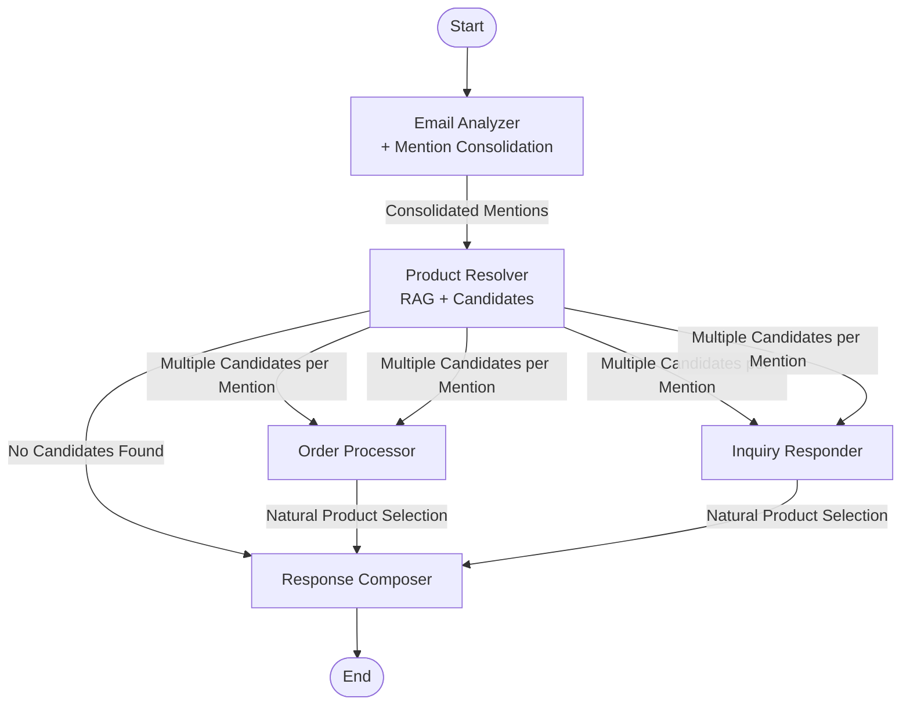

# Agents

This directory contains the implementation of the specialized agents that form the Hermes system:

## 1. Email Analyzer Agent (classifier.py)

This agent serves as the entry point for all customer emails. It:

- Identifies language and analyzes the email's primary intent
- Extracts customer PII and signals
- Segments emails into inquiry, order, and personal statement parts
- Classifies emails as either "product inquiry" or "order request"
- Works with or without email subject lines
- Extracts product references using multiple strategies:
  - Direct ID matching
  - Name-based fuzzy matching
  - Context-based description matching
  - Handling of vague or formatted variations
- **Consolidates duplicate product mentions** to prevent the same product from appearing multiple times:
  - Combines quantities when mentioned separately
  - Merges descriptions and details from multiple references
  - Uses highest confidence score from all references
  - Identifies same products by ID or name+type combinations

The Email Analyzer establishes the context for all subsequent processing by producing a comprehensive `EmailAnalysis` that includes consolidated product mentions across all segments.

## 2. Product Resolver Agent (stockkeeper.py)

This agent takes **consolidated product mentions** from the Email Analyzer and converts them to catalog product candidates. It:

- Receives pre-consolidated product mentions (no deduplication needed)
- Resolves product mentions to top-K catalog product candidates using:
  - Exact ID matching (returns immediately with single result)
  - Semantic vector search with ChromaDB for fuzzy matching
  - Metadata filtering for category-specific searches
- Returns **multiple candidates per mention** instead of trying to pick one
- Provides confidence scores and resolution metadata for each candidate
- Includes original mention context in candidate metadata
- Tracks resolution metrics including candidates found and search performance

**Key Architectural Role**: The Product Resolver serves as a **procedural node** that efficiently bridges unstructured mentions to structured catalog candidates using RAG (ChromaDB vector search), while leaving intelligent product selection to downstream LLM-powered agents.

The Product Resolver produces a `ResolvedProductsOutput` containing candidate products with their confidence scores and any unresolved mentions.

## 3. Order Processor Agent (fulfiller.py)

This agent processes emails containing order requests. It:

- **Naturally selects products** from multiple candidates during LLM processing
- Uses resolved product candidates from the Product Resolver
- Verifies stock availability for requested products
- Updates inventory levels for fulfilled orders
- Processes ordered items with individual status tracking
- Applies promotions using a declarative specification system
- Suggests alternatives for out-of-stock items based on:
  - Same category products
  - Season-appropriate alternatives
  - Complementary items
- Calculates total prices with promotions applied
- Provides detailed order status information

The Order Processor produces a detailed `ProcessedOrder` with information about the order's status and any issues encountered.

## 4. Inquiry Responder Agent (advisor.py)

This agent handles emails containing product inquiries. It:

- **Naturally selects products** from multiple candidates during response generation
- Uses resolved product candidates from the Product Resolver with enhanced formatting
- Groups candidates by original mention for better LLM context
- Uses RAG (Retrieval-Augmented Generation) for semantic product search
- Extracts and classifies questions from inquiry segments
- Answers specific customer questions about products with factual information
- Identifies related products that might interest the customer based on objective criteria
- Handles season and occasion-specific product matching
- Processes mixed-intent emails that contain both inquiry and order segments
- Tracks unanswerable questions due to missing information

**Enhanced Candidate Handling**: The Advisor now receives grouped candidates with confidence scores and makes intelligent selections while generating natural responses.

The Inquiry Responder produces an `InquiryAnswers` object containing factual, objective answers to customer questions.

## 5. Response Composer Agent (composer.py)

This agent takes the outputs from previous agents and creates the final response. It:

- Analyzes customer communication style to determine appropriate tone
- Adapts tone and style to match the customer's communication patterns
- Plans a logical response structure with appropriate greeting and closing
- Processes customer signals to personalize the response
- Ensures all questions and order aspects are addressed
- Generates natural-sounding, non-templated language
- Responds in the customer's original language
- Creates an appropriate subject line for the response email
- Provides structured response points for analysis

The Response Composer produces a `ComposerOutput` containing the final, personalized response text that will be sent to the customer.

## LangGraph Workflow Implementation

The agent communication flow is implemented using LangGraph's state graph API in the `workflow` directory. This implementation:

- Uses a `StateGraph` to define the workflow
- Implements sophisticated routing based on email content
- Maintains a comprehensive `OverallState` throughout the workflow
- Provides node wrapper functions to adapt agent interfaces
- Adds conditional routing based on email intent
- Tracks errors across the entire workflow
- Creates clean integration points between agents

The workflow is defined by the `workflow` object, which orchestrates the entire process from email analysis to final response generation.

## Agent Communication Architecture



# Hermes Agent Workflow

This document describes the flow of the Hermes agent system, showing how customer emails are processed through multiple specialized agents.

## Workflow Overview

The Hermes system uses a directed graph of specialized agents to process customer emails:

1. **Email Analyzer**: Analyzes and classifies the customer email, extracting intents, product mentions, and other key information. **Now includes mention consolidation** to prevent duplicate product references.

2. **Product Resolver**: Takes **consolidated product mentions** from the Email Analyzer and resolves them to **multiple product candidates** from the catalog for downstream selection.

3. **Order Processor** (conditional): If the email contains an order request, processes the order while **naturally selecting the best products** from candidates during LLM processing.

4. **Inquiry Responder** (conditional): If the email contains product inquiries, provides factual information about products while **naturally selecting the most relevant candidates** during response generation.

5. **Response Composer**: Combines outputs from the order processor and inquiry responder to generate a comprehensive response to the customer.

## Key Architectural Principles

### Data Quality at Source
- **Mention Consolidation**: Duplicate product mentions are consolidated at the classifier level, ensuring clean data flows through the entire pipeline
- **Efficient Processing**: Fewer mentions to resolve means faster processing and better resource utilization

### Efficient LLM Usage
- **Single Point of Selection**: Product disambiguation happens naturally during response generation, not in a separate step
- **Contextual Decision Making**: Agents select products while considering customer intent and full conversation context
- **Reduced API Calls**: Eliminated redundant LLM calls for disambiguation

### Enhanced Context Flow
- **Candidate Metadata**: Each product candidate includes confidence scores and original mention context
- **Grouped Presentation**: Multiple candidates are grouped by original mention for clearer LLM reasoning
- **Natural Selection**: Agents pick the most appropriate products while generating natural responses

## Agent Descriptions

### Email Analyzer

- **Purpose**: Understand and extract structured information from customer emails
- **Input**: Raw email text with optional subject line
- **Output**: `EmailAnalysis` with intents, **consolidated product mentions**, and customer information
- **Implementation**: Uses LLM with structured output parsing and mention consolidation logic

### Product Resolver

- **Purpose**: Convert **consolidated product mentions** to **multiple viable candidates** for downstream selection
- **Input**: Consolidated product mentions from Email Analyzer
- **Output**: `ResolvedProductsOutput` with **top-K candidate products per mention** and unresolved mentions
- **Implementation**: Uses ChromaDB semantic search with metadata filtering (RAG)
- **Key Role**: Procedural node that efficiently bridges mentions to candidates using vector search

### Order Processor

- **Purpose**: Process order requests while naturally selecting from product candidates
- **Input**: Email analysis, **multiple product candidates**
- **Output**: `ProcessedOrder` with order status and selected item details
- **Implementation**: Uses stock checking tools and promotion specifications
- **Selection Strategy**: LLM picks best candidates while processing orders

### Inquiry Responder

- **Purpose**: Provide factual answers while naturally selecting relevant products
- **Input**: Email analysis, **grouped product candidates with confidence scores**
- **Output**: `InquiryAnswers` with factual answers and selected products
- **Implementation**: Uses RAG with enhanced candidate formatting
- **Selection Strategy**: LLM chooses most relevant candidates while answering questions

### Response Composer

- **Purpose**: Generate the final personalized customer response
- **Input**: Outputs from all previous agents with selected products
- **Output**: `ComposerOutput` with complete email response
- **Implementation**: Uses strong LLM for natural language generation

## State Management

The system maintains a comprehensive `OverallState` object that accumulates outputs from each agent.
**Consolidated product mentions and candidates** flow through the state with rich metadata, enabling informed selection by downstream agents.

## Error Handling

Each agent includes error handling and fallback strategies. Errors are accumulated in the
state and can be used for diagnostic purposes.

```python {cell}
# In this section, we'll implement the core agents for our email processing system.
# Each agent focuses on a specific task in the workflow, allowing for modular design
# and clear separation of concerns.
from typing import List, Dict, Any, Optional
from pydantic import BaseModel, Field
```