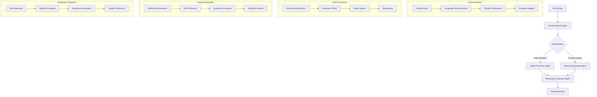

# Hermes: Human-like Email Responses for Magically Empathic Sales - Reference Solution

## Project Overview

Hermes is a proof-of-concept application designed to intelligently process email order requests and customer inquiries for a fashion store. This project serves as the reference solution for the "Solve Business Problems with AI" interview assignment. Its primary goal is to demonstrate the effective use of advanced Large Language Models (LLMs), Retrieval-Augmented Generation (RAG), and vector store techniques to meet the assignment's challenges.

The system will accurately categorize emails, process order requests based on product availability, update stock levels, and generate contextually appropriate, professional responses for both orders and inquiries.

## Assignment Requirements

This solution implements all requirements detailed in the assignment:

1. **Email Classification**: Categorizing emails as either "product inquiry" or "order request".
2. **Order Processing**:
   * Verifying product availability and managing stock.
   * Creating order statuses ("created", "out of stock").
   * Generating tailored response emails for processed orders.
3. **Product Inquiry Handling**:
   * Responding to inquiries using information from a product catalog.
   * Ensuring scalability for a large product catalog (100,000+ products) by using RAG techniques.

The implementation adheres to best practices for AI and LLM tools, focusing on advanced techniques rather than traditional programming methods for core logic.

## Architecture

Hermes follows a multi-agent architecture orchestrated using LangGraph:

* **Email Analyzer Agent**: Responsible for initial email analysis, including classification (order vs. inquiry), language detection, tone analysis, extraction of product references, and identification of customer signals.
* **Order Processor Agent**: Handles emails classified as order requests. It verifies product availability, processes orders, updates stock, and prepares an order summary.
* **Inquiry Responder Agent**: Manages product inquiries. It uses RAG techniques to retrieve relevant information from the product catalog and formulates answers to customer questions.
* **Response Composer Agent**: Generates the final, polished email response to the customer, adapting its tone and content based on the analyses from previous agents and the specific context.

This modular design promotes clarity, maintainability, and showcases the capabilities of modern LLM frameworks in solving complex business problems.

## Architecture Diagram



## Special Design Considerations

1. **Vector Store Implementation**: We use ChromaDB for implementing the RAG pattern, with OpenAI embeddings to create a searchable vector representation of the product catalog.

2. **Customer Signal Processing**: The system implements a sophisticated signal detection and response framework that identifies subtle cues in customer emails (purchase intent, emotion, communication style) and adapts responses accordingly.

3. **Multi-Language Support**: The solution can handle emails in different languages, maintaining appropriate tone and content in responses.

4. **Complex Product References**: A robust product resolution system handles various ways customers might refer to products (direct IDs, partial names, vague descriptions, etc.).

5. **Tone Adaptation**: Responses dynamically match the customer's communication style while maintaining professionalism.

```python {cell}
# This notebook requires the following packages:
# Run this cell to install all necessary dependencies
%pip install openai langchain langchain_openai langchain_community langgraph pydantic "chromadb>=0.4.6" thefuzz gspread gspread_dataframe google-auth-oauthlib pandas httpx
``` 