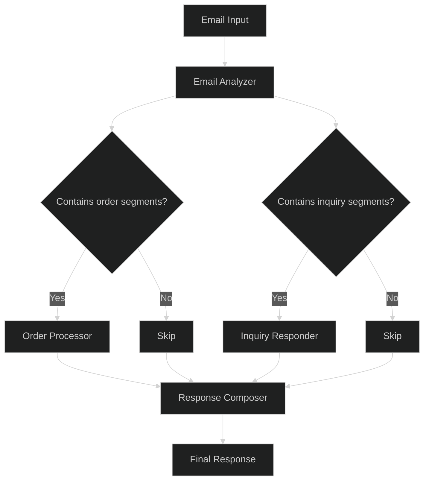

# Agents

This directory contains the implementation of the four specialized agents that form the Hermes system:

## 1. Email Analyzer Agent (email_analyzer.py)

This agent serves as the entry point for all customer emails. It:

- Identifies language
- Segments emails into inquiry, order, and personal statement parts
- Classifies emails as either "product inquiry" or "order request"
- Works with or without email subject lines
- Extracts product references using multiple strategies:
  - Direct ID matching
  - Name-based fuzzy matching
  - Context-based description matching
  - Handling of vague or formatted variations

The Email Analyzer establishes the context for all subsequent processing by producing a comprehensive `EmailAnalysisResult` that guides the workflow.

## 2. Order Processor Agent (order_processor.py)

This agent processes emails containing order requests. It:

- Verifies stock availability for requested products
- Updates inventory levels for fulfilled orders
- Suggests alternatives for out-of-stock items based on:
  - Same category products
  - Season-appropriate alternatives
  - Complementary items
- Identifies and processes product promotions

The Order Processor produces a detailed `OrderProcessingResult` with information about the order's status and any issues encountered.

## 3. Inquiry Responder Agent (inquiry_responder.py)

This agent handles emails containing product inquiries. It:
- Uses RAG (Retrieval-Augmented Generation) for semantic product search
- Answers specific customer questions about products
- Identifies related products that might interest the customer
- Handles season and occasion-specific product matching
- Processes mixed-intent emails that contain both inquiry and order segments

The Inquiry Responder produces an `InquiriesResponse` containing the answers for each inquiry.

## 4. Response Composer Agent (response_composer.py)

This agent takes the outputs from previous agents and creates the final response. It:
- Adapts tone and style to match the customer's communication
- Processes customer signals to personalize the response
- Ensures all questions and order aspects are addressed
- Generates natural-sounding, non-templated language
- Responds in the customer's original language
- Handles customer context, objections, and irrelevant information

The Response Composer produces the final response text that will be sent to the customer.

## LangGraph Workflow Implementation

The agent communication flow is implemented using LangGraph's functional API in `workflow.py`. This implementation:

- Uses the `@task` decorator to wrap each agent function
- Implements flexible routing based on email content
- Provides comprehensive error handling
- Maintains state throughout the workflow
- Uses memory checkpointing for potential continuation
- Follows a clear sequence of operations with conditional branches

The workflow is defined by the `hermes_workflow` function, which orchestrates the entire process from email analysis to final response generation.

## Agent Communication Architecture



**Note**: Emails with mixed intent will be routed to both the Order Processor and Inquiry Responder if they contain segments of both types.

```python {cell}
# In this section, we'll implement the core agents for our email processing system.
# Each agent focuses on a specific task in the workflow, allowing for modular design
# and clear separation of concerns.
from typing import List, Dict, Any, Optional
from pydantic import BaseModel, Field
``` 